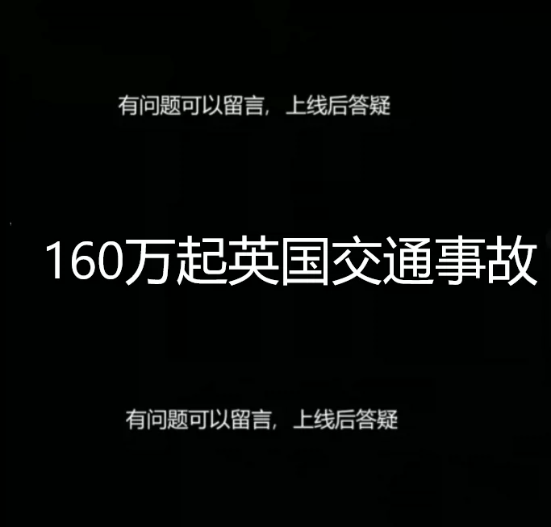
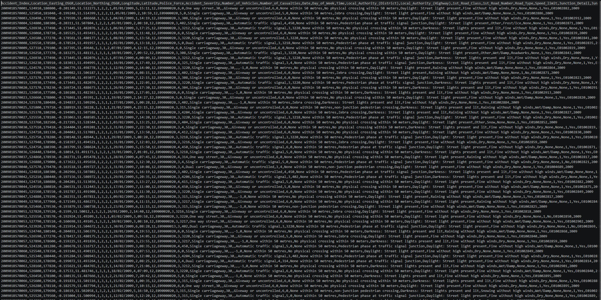
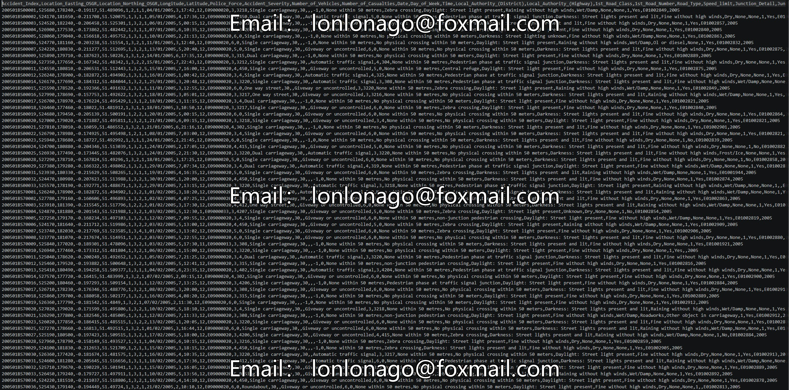
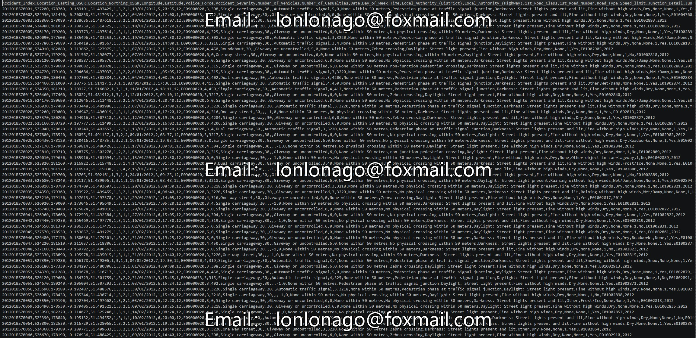

## Body

160 million UK traffic accident dataset

The UK government collected traffic data from 2000 to 2016, recording over 1.6 million accidents, making it one of the most comprehensive traffic datasets available.
Please note that all accident data is sourced from police reports, so minor accidents are not included.

Content
ukTrafficAADF.csv tracks the traffic volume on all major roads during the period from 2000 to 2014. AADT, the core statistical figure in this file, represents "average annual daily traffic," measured by vehicle passages, and reflects the activity of road sections. The page on AADT on Wikipedia is a good reference for this topic.

The accident data is divided into three CSV files: these three archives together total 1.6 million traffic accidents. The entire timeframe spans from 2005 to 2014, but 2008 is missing. Accidents_2005_to_2007.csv Accidents_2009_to_2011.csv Accidents_2012_to_2014.csv

The UK Department for Transport provides data dictionary for the original dataset. For descriptions of individual columns, please see column metadata.

Acknowledgements
The dataset is licensed under the Open Government Licence. The original dataset can be accessed through the UK Department for Transport website.

Inspiration
How does traffic flow change affect accidents?
Can we predict how accident rates change over time? What methods can improve accident rates?
Draw trend maps to illustrate changes, such as: what has changed for cyclists in London? Which are the busiest roads nationwide?
What areas never change, why? Identifying infrastructure needs, failures, and successes.
What differs between rural and urban areas (see)? Then, what's different between England, Scotland, and Wales? RoadCategory
The UK government also likes to look at mileage traveled. You can achieve this by multiplying AADF by the corresponding road length (linked length) and the number of days per year. This tells you what about the national roads?

## Images

item_1041662191886

Here is a pay link on Stripe ( https://buy.stripe.com/3cs8yP7sY87d0vu9AB ). Please contact me lonlonago@foxmail.com after funding $89, and I will send you a complete data files , thank you!

